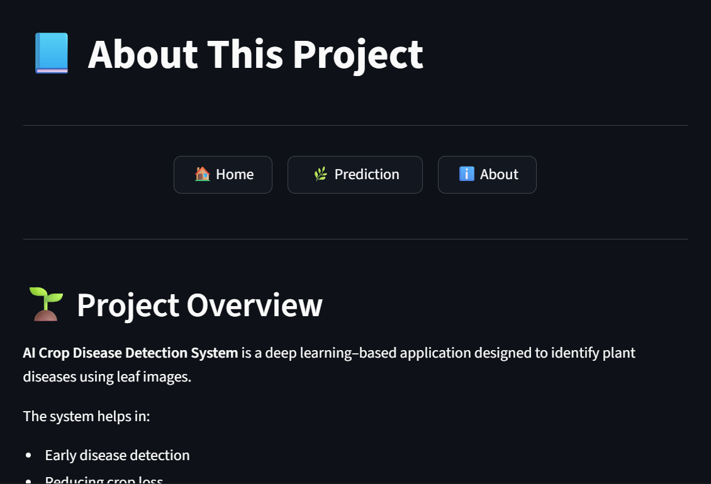

# 🌿 AI Crop Disease Detection

🔗 **Live Application:**  
https://ai-crop-disease-detection-8ueyakayyktndwiwmfjoh2.streamlit.app/

---

## 🚀 Project Overview

AI Crop Disease Detection is a deep learning–powered web application that detects plant leaf diseases from uploaded images using a custom Convolutional Neural Network (CNN) built with PyTorch.

The system analyzes crop leaf images and predicts potential diseases while providing structured information including:

- Disease summary  
- Causes  
- Treatment recommendations  
- Prevention strategies  

This project demonstrates a complete **end-to-end AI pipeline**, from model training to cloud deployment.

---

## 🧠 Model Architecture

The model is a custom Residual CNN architecture designed for multi-class plant disease classification.

### 🔬 Architecture Highlights

- Custom `ConvBlock` modules
- Batch Normalization
- ReLU activation
- Residual connections (ResNet-inspired)
- MaxPooling layers
- Fully connected classifier
- Softmax output layer

### 📥 Input

- RGB leaf image
- Resized to **256 × 256**
- Tensor conversion using PyTorch transforms

---

## 📸 Application Screenshots

### 🏠 Home Page


---

### 📤 Image Upload Interface


---

### 🧠 Prediction Result


---

### 📋 Disease Information Section


---

### ℹ️ About Page



---

## 🌾 Supported Crops & Diseases

The model supports disease classification across multiple crops:

- Apple
- Blueberry
- Cherry
- Corn (Maize)
- Grape
- Orange
- Peach
- Bell Pepper
- Potato
- Raspberry
- Soybean
- Squash
- Strawberry
- Tomato

Total Classes: **38**

---

## 🖥️ Web Application Features

- 📤 Drag-and-drop image upload
- 🧠 Real-time AI prediction
- 📋 Detailed disease information
- 🎨 Premium dark UI design
- 🔐 Production-structured architecture
- ☁️ Deployed on Streamlit Cloud

---

## 📁 Project Structure
AI-Crop-Disease-Detection/

│
├── app.py

├── models/

│ └── plant_disease_model.pth

├── pages/

│ ├── prediction.py

│ ├── disease.py

│ ├── about_app.py

├── images

├── requirements.txt

├── .gitignore

└── README.md

---

## ⚙️ Installation (Run Locally)

### 1️⃣ Clone Repository
```
git clone https://github.com/jay51211/AI-Crop-Disease-Detection.git

cd AI-Crop-Disease-Detection
```

### 2️⃣ Install Dependencies
```
pip install -r requirements.txt
```

### 3️⃣ Run Application
```
streamlit run app.py
```

---

## 🧪 Training Details

- Framework: PyTorch
- Loss Function: CrossEntropyLoss
- Optimizer: Adam
- Dataset: Plant Village Dataset
- Image Size: 256 × 256
- Multi-class classification (38 classes)

---

## 📦 Model Deployment

The trained `.pth` model file is stored using **Git LFS** to handle large file size efficiently.

The application loads the model dynamically from:
```
models/plant_disease_model.pth
```

---

## 🔐 Production-Grade Practices Implemented

- Modular architecture (UI separated from model logic)
- Safe dictionary access to prevent runtime crashes
- Git LFS for large model storage
- Clean `.gitignore` configuration
- Cloud-ready file path handling
- No absolute local paths used

---

## ⚠️ Disclaimer

This application provides AI-generated predictions for educational and research purposes only.  
For accurate agricultural diagnosis, always consult a certified agricultural expert.

---

## ⭐ Future Improvements

- Confidence visualization enhancements
- Model optimization for faster inference
- Mobile-optimized UI
- Multi-language support
- API version of prediction system

---

## 📜 License

This project is open-source and available under the MIT License.

---

If you find this project useful, please consider giving it a ⭐ on GitHub.
